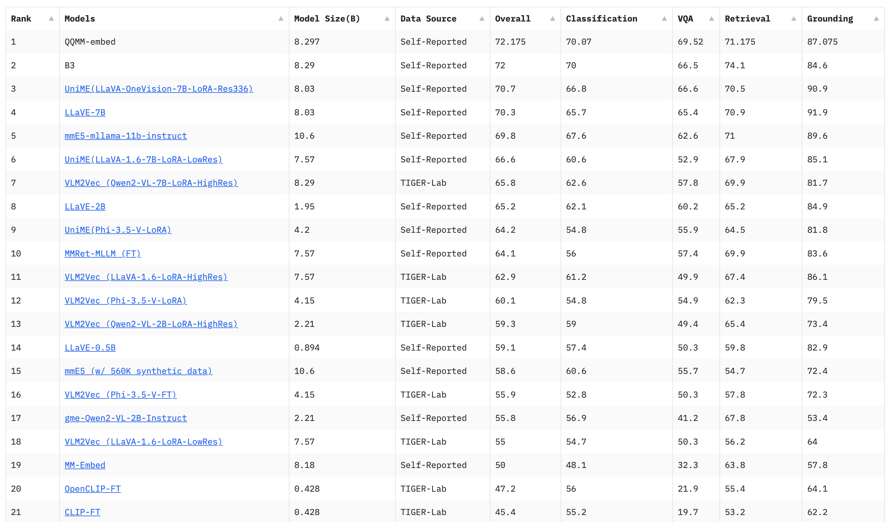

## QQMM-embed

QQMM-embed is a multimodal embedding model developed by TencentQQ Multimedia Research Team.

### MMEB Leaderboard
QQMM-embed is trained on [MMEB (Massive Multimodal Embedding Benchmark)]( https://github.com/TIGER-AI-Lab/VLM2Vec) training set and evaluated on the MMEB-eval set. 

On 2025-05-07, QQMM-embed achieved **the top 1** on [MMEB Leaderboard](https://huggingface.co/spaces/TIGER-Lab/MMEB).




### Environment
Inference using Huggingface transformers on NVIDIA GPUs. Requirements tested on python 3.8.8.
```
pip install -r requirements.txt
```

### Inference
```
import sys
import os
import torch
from PIL import Image

from qqmm.models import build_processor
from qqmm.utils.parameter_manage import Parameters
from qqmm.models.qqmm_nav_qwen2.modeling_qqmm import QQMMForCausalLM
from qqmm.utils.chat import EmbedBot

config = Parameters()
config.merge_from_yaml('./configs/embed/qqmm-embed/mmeb.yaml')

print(">>> Building Model...")
processor = build_processor(config.PROCESSOR_CONFIG, inferring=True)
model = QQMMForCausalLM.from_pretrained('youzexue/QQMM-embed-v1', torch_dtype=torch.bfloat16, device_map='cuda')
bot = EmbedBot(model, processor)

print(">>> Inference...")
img = Image.open('assets/dog.png').convert("RGB")
img_feat = bot.chat(text='Represent the given image for classification.', image=[img])
txt_feat = bot.chat(text='Represent the following answer to an image classification task: a lovely dog.')
sim = (img_feat * txt_feat).sum()
print('Similarity score: ', sim)
```

### Acknowledgments
- [MMEB benchmark](https://github.com/TIGER-AI-Lab/VLM2Vec) A comprehensive framework for training and evaluating multimodal embedding models developed by TIGER-Lab.

- [Qwen2-VL-7B-Instruct](https://huggingface.co/Qwen/Qwen2-VL-7B-Instruct) Powerful large multimodal models developed by Alibaba.

- [Qwen2.5-7B-Instruct](https://huggingface.co/Qwen/Qwen2.5-7B-Instruct) Excellent language models developed by Alibaba.